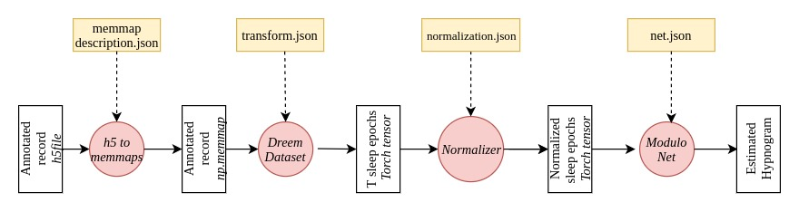
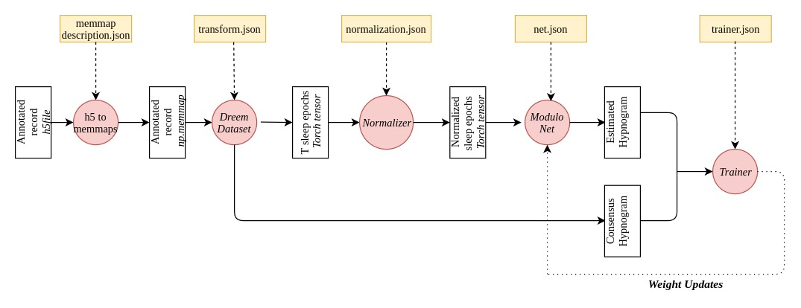
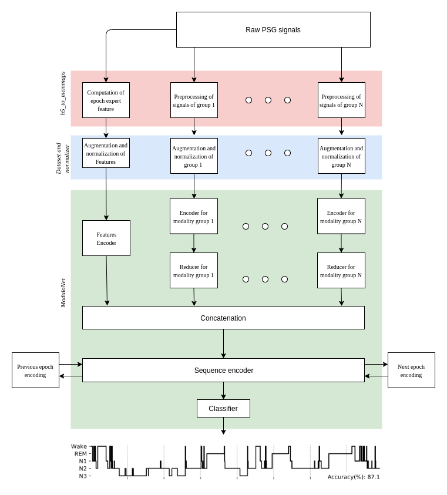

# RobustSleepNet

The repo is contains the code from our paper [RobustSleepNet: Transfer learning for automated sleep staging at scale](https://ieeexplore.ieee.org/document/9492125):

- It allows to train a model on data from one or several sleep studies and to use it to perform sleep staging accurately
  on an unseen sleep study. RobustSleepNet works out-of-the box on new sleep studies (even with a different PSG montage)
- We provide pretrained models and a command line interface to perform sleep staging easily on a .edf record.

The readme is two organised in two parts:

- The first part is aimed at sleep practitioner who want to use RobustSleepNet to perform sleep staging on their sleep
  studies.
- The second part is aimed at people who wish to understand the code to train new models, reproduce/improve our work or
  to understand what is happening under the hood.


## Part 1: How to use RobustSleepNet to perform sleep staging on .edf files. 
By installing the package you can easily perform sleep staging on .edf files. The software will try to automatically detect suitable derivations to perform sleep staging.

1. install python-3.7.6 using this link: https://www.python.org/downloads/release/python-376/
2. Install the robust_sleep_net package with 
```
pip install git+https://github.com/Dreem-Organization/RobustSleepNet.git
```
3.If your file is saved as /path/to/record/record.edf. Run the command: 
```
inference_on_edf_file /path/to/record/record.edf
``` 
4.The hypnogram from the sleep staging model is saved in the /path/to/record/ folder

The following options are available:
- --electrodes, default = None, 'List of electrodes to use to perform the sleep staging.'
- --outfolder, help='Folder where the hypnogram will be save'
- --timezone, default='Europe/London', help='Timezone of the EDF file'
- --lights_on, default=None, help='Light on time (timestamp format)'
- --lights_off, default=None, help='Light off time (timestamp format)'
- --start_minute, default=False, help='Should the staging start on round minutes ?'
- --start_30s, default=False, help='Should the staging start on round 30 seconds ?'
- --consensus_of_models, default=False, help='Should the staging start on round 30 seconds ?'


Example of CLI uses:
```
inference_on_edf_file /path/to/record/record.edf --consensus_of_models True
inference_on_edf_file /path/to/record/record.edf --consensus_of_models True --electrodes ['EEG Fpz-Cz']
```

## Part 2: Replicating the paper result

### Prerequisites

The library was packaged using [poetry][https://python-poetry.org/] which has to be installed. Once installed, the
python environment with the required dependencies can be created with 'poetry install' run from the root directory.
Pytorch is used as our Deep Learning environment

A setting.py file has to be created and imported in your scripts to provide the data location. The file should closely
follow the format of the provided settings_template.py file.

```python
import os

VERSION = "1_03"
# Suggested directory where H5 and memmaps will be stored
BASE_DIRECTORY = "/data/"
BASE_DIRECTORY_H5 = BASE_DIRECTORY + "h5/"
if not os.path.exists("/memmap/"):
    BASE_DIRECTORY_MEMMAP = BASE_DIRECTORY + "memmap/"
else:
    BASE_DIRECTORY_MEMMAP = "/memmap/"

EXPERIMENTS_DIRECTORY = BASE_DIRECTORY + "experiments/"
DATASET_DIRECTORY = BASE_DIRECTORY + "datasets/"

DODH_BASE_DIRECTORY = DATASET_DIRECTORY + "dodh/"
DODH_SETTINGS = {
    "records": DODH_BASE_DIRECTORY + "h5/",
    "h5_directory": BASE_DIRECTORY_H5 + "dodh/",
    "memmap_directory": BASE_DIRECTORY_MEMMAP + "dodh/",
}

DODO_BASE_DIRECTORY = DATASET_DIRECTORY + "dodo/"
DODO_SETTINGS = {
    "records": DODO_BASE_DIRECTORY + "h5/",
    "h5_directory": BASE_DIRECTORY_H5 + "dodo/",
    "memmap_directory": BASE_DIRECTORY_MEMMAP + "dodo/",
}

SLEEP_EDF_BASE_DIRECTORY = DATASET_DIRECTORY + "sleep_edf/"
SLEEP_EDF_SETTINGS = {
    "base_directory": SLEEP_EDF_BASE_DIRECTORY,
    "edf_directory": [
        f"{SLEEP_EDF_BASE_DIRECTORY}/sleep-edf-database-expanded-1.0.0/sleep-cassette/",
        f"{SLEEP_EDF_BASE_DIRECTORY}/sleep-edf-database-expanded-1.0.0/sleep-telemetry",
    ],
    "h5_directory": BASE_DIRECTORY_H5 + "sleep_edf/",
    "memmap_directory": BASE_DIRECTORY_MEMMAP + "sleep_edf/",
}
SLEEP_EDF_IN_BED_SETTINGS = {
    "base_directory": SLEEP_EDF_BASE_DIRECTORY,
    "edf_directory": [
        f"{SLEEP_EDF_BASE_DIRECTORY}/sleep-edf-database-expanded-1.0.0/sleep-cassette/",
        f"{SLEEP_EDF_BASE_DIRECTORY}/sleep-edf-database-expanded-1.0.0/sleep-telemetry",
    ],
    "h5_directory": BASE_DIRECTORY_H5 + "sleep_edf_in_bed/",
    "memmap_directory": BASE_DIRECTORY_MEMMAP + "sleep_edf_in_bed/",
}

CAP_BASE_DIRECTORY = DATASET_DIRECTORY + "cap/"
CAP_SETTINGS = {
    "base_directory": CAP_BASE_DIRECTORY,
    "h5_directory": BASE_DIRECTORY_H5 + "cap/",
    "memmap_directory": BASE_DIRECTORY_MEMMAP + "cap/",
}

MASS_BASE_DIRECTORY = DATASET_DIRECTORY + "mass/"
MASS_SETTINGS = {
    "records_directory": MASS_BASE_DIRECTORY + "records/",  # exemple de nom de fichier
    "annotations_directory": MASS_BASE_DIRECTORY + "annotations/",  # exemple de nom de fichier
    "h5_directory": BASE_DIRECTORY_H5 + "mass/",
    "memmap_directory": BASE_DIRECTORY_MEMMAP + "mass/",
}

MESA_BASE_DIRECTORY = DATASET_DIRECTORY + "mesa/"

MESA_SETTINGS = {
    "records_directory": MESA_BASE_DIRECTORY + "records/",
    "annotations_directory": MESA_BASE_DIRECTORY + "annotations/",
    "index_directory": MESA_BASE_DIRECTORY + "index.json",
    "h5_directory": BASE_DIRECTORY_H5 + "mesa/",
    "memmap_directory": BASE_DIRECTORY_MEMMAP + "mesa/",
}

SHHS_BASE_DIRECTORY = DATASET_DIRECTORY + "shhs/"
SHHS_SETTINGS = {
    "records_directory": SHHS_BASE_DIRECTORY + "records/",
    "annotations_directory": SHHS_BASE_DIRECTORY + "annotations/",
    "h5_directory": BASE_DIRECTORY_H5 + "shhs/",
    "memmap_directory": BASE_DIRECTORY_MEMMAP + "shhs/",
}

MROS_BASE_DIRECTORY = DATASET_DIRECTORY + "mros/"
MROS_SETTINGS = {
    "records_directory": MROS_BASE_DIRECTORY + "records/",
    "annotations_directory": MROS_BASE_DIRECTORY + "annotations/",
    "h5_directory": BASE_DIRECTORY_H5 + "mros/",
    "memmap_directory": BASE_DIRECTORY_MEMMAP + "mros/",
}

if not os.path.isdir(BASE_DIRECTORY):
    os.mkdir(BASE_DIRECTORY)

if not os.path.isdir(BASE_DIRECTORY_H5):
    os.mkdir(BASE_DIRECTORY_H5)

if not os.path.isdir(BASE_DIRECTORY_MEMMAP):
    os.mkdir(BASE_DIRECTORY_MEMMAP)

```

The file defines the directory where the records are stored and where the h5 and the memmaps will be saved. These files
can be large (up to 1Go per record).

### Downloading the datasets from the paper:

We use 8 different datasets in the paper:

- [DODO](https://github.com/Dreem-Organization/dreem-learning-open): Open Access
- [DODH](https://github.com/Dreem-Organization/dreem-learning-open): Open Access
- [MASS](http://www.ceams-carsm.ca/mass): Open Access upon request
- [Sleep EDF Expanded](https://physionet.org/content/sleep-edfx/1.0.0/): Open Access
- [MROS](https://sleepdata.org/datasets/mros): Open Access upon request
- [MESA](https://sleepdata.org/datasets/mesa): Open Access upon request
- [SHHS](https://sleepdata.org/datasets/shhs): Open Access upon request
- [CAP](https://physionet.org/content/capslpdb/1.0.0/): Open Access

Demographics and description of each dataset can be found in the paper. We provide the script to download the four open
access datasets in the minimal example.py.

## Pipeline overview

The inference pipeline is divided into 5 steps:

1. **EDF to h5 processing**: As most datasets are stored in .edf format, we convert them into standardized .h5 files.
   Scripts to convert dataset to h5 are provided into scripts/datasets_to_h5/ for each of the dataset of the paper.
2. **H5 to memmap processing**: Each standardized h5 is converted to a folder where the different signals, the record
   hypnogram and metadata are stored. Most of the "heavy" preprocessing (resampling, filering, record rescaling) is
   performed at that step.

   It's at that step that records from different datasets are made compatible:
    - They should be scaled similarly
    - They must have the same sampling frequency
    - They don't need to have the same number of derivations or the same modalities.
3. **Dataset object**: Given a list of records converted to the memmap format, the Dataset object parse the memmap to
   build a torch dataset. It builds reference to these memmaps for fast and concurrent access during the training
   process. The DreemDataset returns the data for a sequence of sleep epoch (a dict of torch tensor, each tensor
   represents a modality) and the scoring for this epoch.
4. **Normalizer**: Each modality is normalized. Normalization operations include clipping, spectrogram computations,
   centering, ... they are operations that are fast enough to be run during training.
5. **ModuloNet**: The class defines a specific network topology general enough to represent most of the sleep staging
   architectures. The user can provide the specific modules to be used in the network and the normalizer that will
   normalize the network input.
6. **Trainer**: Given a ModuloNet, a DreemDataset and a trainer configuration, the Trainer will train the ModuloNet on
   the DreemDataset. Train, validation and test dataset can be specified by using several datasets.

Fig 1. shows the overall inference pipeline, Fig 2. adds the Trainer and its retroaction on the model during training.

<div align="center">
<figure>
<figcaption><em>Fig 1: Inference Pipeline</em></figcaption>
<div align="center">

    </div>
</figure>
</div>


<br>

<figure>
<div align="center">
<figcaption><em>Fig 2: Training Pipeline</em></figcaption>
</div>
<div align="center">

    </div>
</figure>
</div>

## Memmaps creations and preprocessing

The memmaps creation is done using the preprocessings.h5_to_memmaps function. The function requires the list of the
records to process, and the memmap description. The memmap description describes the preprocessing and grouping
operations to be applied to the signals. It also describes the expert features to compute: the signal(s) to use for
computation and the type of computation to apply. Once run, h5_to_memmaps build a folder which contains the formatted
records, and .json describing the dataset.

This configuration is contained in a dict of the following form:

```json
{
  "signals": [
    {
      "name": "eeg",
      "signals_name": [
        "dodh_C3_M2",
        "dodh_F4_M1",
        "dodh_F3_F4",
        "dodh_F3_M2",
        "dodh_F4_O2",
        "dodh_F3_O1",
        "dodh_FP1_F3",
        "dodh_FP1_M2",
        "dodh_FP1_O1",
        "dodh_FP2_F4",
        "dodh_FP2_M1",
        "dodh_FP2_O2",
        "dodh_EMG",
        "dodh_EOG1",
        "dodh_EOG2"
      ],
      "signals": [
        "signals/eeg/C3_M2",
        "signals/eeg/F4_M1",
        "signals/eeg/F3_F4",
        "signals/eeg/F3_M2",
        "signals/eeg/F4_O2",
        "signals/eeg/F3_O1",
        "signals/eeg/FP1_F3",
        "signals/eeg/FP1_M2",
        "signals/eeg/FP1_O1",
        "signals/eeg/FP2_F4",
        "signals/eeg/FP2_M1",
        "signals/eeg/FP2_O2",
        "signals/emg/EMG",
        "signals/eog/EOG1",
        "signals/eog/EOG2"
      ],
      "processings": [
        {
          "type": "filter_bandpass",
          "args": {}
        },
        {
          "type": "poly_resample",
          "args": {
            "target_frequency": 60
          }
        },
        {
          "type": "normalize_signal_IQR",
          "args": {
            "clip_IQR": 20
          }
        },
        {
          "type": "padding",
          "args": {
            "padding_duration": 900,
            "value": 0
          }
        }
      ]
    }
  ],
  "features": []
}
```

"signals" defines the list of modalities. Each modality is defined by the list of path to input signals and the
processings to apply to these signals. Signals within a modality need to have the same frequency, the same length and
the same padding. This has been designed for a maximum flexibility, it is easy to split the signals into different
modalities and to use different processings and epoch encoders. However, in the paper and in the following examples, a
single modality is used most of the time.

The following preprocessings are available: *
"poly_resample",
"filter_bandpass",
"padding",
"weighted_sum",
"rescale",
"normalize_signal_IQR"*

"feature" defines the list of expert features to compute. Each features is defined by the type of feature to compute,
the argument to use to compute this feature and the signal on which the feature should be computed. The following
features are available: *index_window, cyclic_index_window, fft, signal_statistics, shannon_entropy, spectral_power.*

## Dataset Creation

*datasets.dataset.DreemDataset* defines a dataset class suitable for sleep staging. It takes the following arguments:

* records (str): path to the memmap folder of the records to include in the Dataset
* temporal_context (int): number of sleep epochs to use for sleep staging.
* groups_description (dict): dictionaries which describe the shape of the signals. The corresponding json (
  groups_description.json) can be found at the root of the output folder of h5_to_memmap.
* features_description (dict): dictionaries which describe the shape of the features. The corresponding json (
  features_description.json) can be found at the root of the output folder of h5_to_memmap.
* transform_parameters (list): specifies augmentations to be applied during **training** on the input.
```json
[
  {
    "name": "eeg",
    "processing": [
      {
        "type": "kill_channel",
        "args": {
          "p": 0.5
        }
      }
    ]
  }
]
```
* hypnogram_filename (str): name of the hypnogram file to use as target (when multiple hypnograms are available for a record)


The class only keeps the epoch with sufficient temporal context and sleep stage value between 0 and 4. 

Data can be queried with two methods:
- *get_item* which mixes sleep epoch from all the record. This method can be run in training mode or evaluation mode. In training mode, random signals are sampled from the available signals for the record. In evaluation mode, all the signals are used.
- *get_record* which outputs the consecutive sleep epochs from a given record.

## Normalization Pipeline

Normalization operations are models specific operations applied to ensure that the input data is within the model
definition range. The operations are implemented in Pytorch, and simple enough to be run on-the-fly during training.

Available normalization operations are : *clip*, *affine* (affine rescaling of the signal), *standardization* (0-mean,
1-variance centering), *standardize online* (standardization on the current epochs of sleep), *spectrogram* (compute the spectrogram signal-wise), *clip_and_scale*. Normalization are applied
sequentially. When operations have to be initialized (like *standardization*), the
initialization is done over the training set after the previous normalization steps have been applied.

```json
{
  "signals": [
    {
      "name": "eeg",
      "normalization": [
        {
          "type": "clip_and_scale",
          "args": {
            "min_value": -20,
            "max_value": 20
          }
        },
        {
          "type": "spectrogram",
          "args": {
            "logpower": true,
            "window_duration": 2,
            "window_overlap": 1,
            "fs": 60,
            "clamp": 1e-20
          }
        },
        {
          "type": "standardize_online",
          "args": {
            "axis": [
              1,
              -1
            ]
          }
        }
      ]
    }
  ],
  "features": [
  ]
}
```

## ModuloNet configuration

The *ModuloNet* class allows defining and training flexible deep learning architecture for sleep staging. Most of the
recent approaches can be implemented using this paradigm. Specifics epochs encoder have to be defined for each of the
group of signals. Similarly, a specific encoder have to be defined for the features. Then a reducer is applied to the
output of the epochs encoder, the reducer is used to remove the temporal dimension. Then, the encoded epochs and the
features are concatenated. If the temporal context is greater than one, they are processed by a sequence encoder.


<figure>
<div align="center">
<figcaption><em>Fig 3: Modulo Net architecture</em></figcaption>
</div>
<div align="center">

    </div>
</figure>
</div>

Here is an example of a configuration file for RobustSleepNet:

```json
{
  "n_class": 5,
  "type": "modulo_net",
  "output_mode": "many",
  "eval_output_mode": "many",
  "encoders": {
    "eeg": {
      "type": "RobustSleepEncoder",
      "args": {
        "hidden_layers": 64,
        "filter_dim": 32,
        "dropout": 0.5,
        "bidir": true,
        "context_size": 30,
        "n_virtual_channels": 4
      }
    }
  },
  "reducers": {
    "eeg": {
      "type": "AttentionWithReduction",
      "args": {
        "context_size": 25,
        "output_dim": 50
      }
    }
  },
  "modalities_merger": {
    "type": "Concatenation",
    "args": {}
  },
  "sequence_encoder": {
    "type": "ResidualGRUSequenceEncoder",
    "args": {
      "cells": 50,
      "dropout": 0.5,
      "bidir": true,
      "layers": 2
    }
  }
}
```

ModuloNet can be saved and load under .gz format using *.load* and *.save* methods.

## Training

Training is handled by the *Trainer* class. The trainer is defined upon a ModuloNet and update its weights during the
training loop given a DreemDataset. The arguments provided to the trainer are similar to the ones used by trainers from
other libs:

```json
{
  "epochs": 100,
  "patience": 15,
  "optimizer": {
    "type": "adam",
    "args": {
      "lr": 1e-3
    }
  }
}
```

## Logger and wrapping of all the steps

The package also provides a *log_experiment* class which applies the complete pipeline given the ".json" config files
defined above (
*memmaps.json, transform.json,normalization.json, trainer.json, net.json*) and a list of h5 records:

```python
from robust_sleep_net.logger.logger import log_experiment
from robust_sleep_net.utils.train_test_val_split import train_test_val_split
from robust_sleep_net.settings_template import DODO_SETTINGS
import json
import os

memmap_description = json.load(open('scripts/train/config/memmaps_description/dodo.json'))
normalization = json.load(open('scripts/train/config/model_settings/normalization.json'))
trainer = {
    'epochs': 100,
    'patience': 15,
    'optimizer': {
        'type': 'adam',
        'args': {
            'lr': 1e-3
        }
    }
}
net = json.load(open('scripts/train/config/model_settings/description.json'))
records = ["{}/{}/".format('path_to_records', record) for record in os.listdir('path_to_h5')]
temporal_context = 21

train_records, val_records, test_records = train_test_val_split(records, 0.6, 0.2,
                                                                0.2,
                                                                seed=2019)
experiment_description = {
    'memmap_description': memmap_description,
    'dataset_settings': DODO_SETTINGS,
    'trainer_parameters': trainer,
    'normalization_parameters': normalization,
    'net_parameters': net,
    'dataset_parameters': {
        'split': {
            'train': train_records,
            'val': val_records,
            'test': test_records
        },
        'temporal_context': temporal_context,
        'input_temporal_dimension': input_temporal_context

    },
    'save_folder': "my_experiment_folder"

}

experiment_folder = log_experiment(**experiment_description, parralel=True)

```

*folder* contains all the model checkpoints over the epochs, a description file which describes the model performances
and parameters used to train the model.

## Inference on new records

Given a trained ModuloNet and a list of records, the inference pipeline (Fig. 1) can be used to estimate the sleep
staging. The different stages can either be performed one by one:

```python


from robust_sleep_net.datasets.dataset import DreemDataset
from robust_sleep_net.models.modulo_net.net import ModuloNet
from robust_sleep_net.trainers import Trainer
from robust_sleep_net.preprocessings.h5_to_memmap import h5_to_memmaps
import json
import os

memmaps_description = json.load("memmaps_description.json")  # As defined above
records_h5_folder = 'records/h5/'
records_memmaps_folder = 'records/memmaps/'
output_memmap_folder, groups_description, features_description = h5_to_memmaps(records_h5_folder,
                                                                               records_memmaps_folder,
                                                                               memmaps_description)

net = ModuloNet.load('model.gz')
trainer_parameters = {
    "epochs": 100,
    "patience": 15,
    "optimizer": {
        "type": "adam",
        "args": {
            "lr": 1e-3
        }
    }
}
trainer = Trainer(net=net,
                  **trainer_parameters
                  )

dataset_test = DreemDataset(groups_description, features_description=features_description,
                            temporal_context=21,
                            records=["{}/{}/".format(output_memmap_folder, record) for record in
                                     os.listdir(output_memmap_folder)])
performance_on_test_set, _, performance_per_records, hypnograms = trainer.validate(dataset_test,
                                                                                   return_metrics_per_records=True,
                                                                                   verbose=True)


```

They can also be wrapped into a single stage:

```python
from robust_sleep_net.datasets.dataset import DreemDataset
from robust_sleep_net.logger.logger import evaluate_experiment_on_records
import json
from robust_sleep_net.preprocessings.h5_to_memmaps import h5_to_memmaps
import os

memmaps_description = json.load("memmaps_description.json")  # As defined above
records_h5_folder = 'records/h5/'
records_memmaps_folder = 'records/memmaps/'
output_memmap_folder, groups_description, features_description = h5_to_memmaps(records_h5_folder,
                                                                               records_memmaps_folder,
                                                                               memmaps_description)
records_to_eval = [output_memmap_folder + '/ ' + record for record in os.listdir(output_memmap_folder)]
evaluate_experiment_on_records(records_to_eval, experiment_folder)

```

## Minimal example
We provide a minimal example to train RobustSleepnet on DODO, DODH, CAP and Sleep EDF in a Direct Transfer learning setting.
The script download the data, process them and train the model. Once run, four output folder will be created. Each folder contains:
- a training folder, with models snapshot at each epoch
- best_model.gz, the model with the highest validation loss
- description.json: which describe the parameters used to produce the experiment as well as the performance of the model. Note that performances are reported per record and not per epoch as in the paper.
- hypnograms.json: output hypnograms on the target dataset

## Reproducing the paper's results:
First the data from each dataset have to be downloaded and processed using scripts/datasets_to_h5
The scripts/train folder contains the training file for each table and figure of the paper. 
The scripts/evaluation folder, compute the results once the experiment have been ran.
The scripts/plots contains the scripts to replicate the plot from the paper by using the data produced by the evaluation scripts.